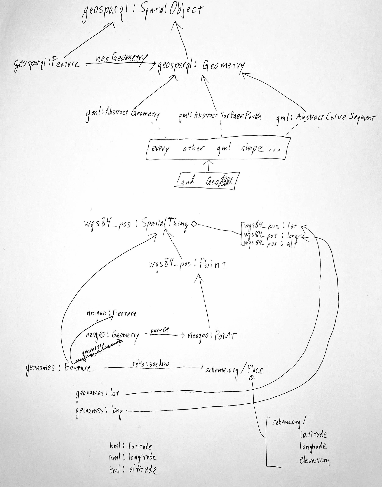

# Formats and Schemas

## Formats

There are a few different formats in which data is stored and shared. Knowing about these is important for building geospatial applications. Each format has a specific purpose. Some formats are specifically for storing vector shapes, some encode the surface of Earth in a grid of pixels, some encode 3D point clouds, and yet others are intended for sharing data on the semantic web.

This only lists the file formats I've recently come across. This is not a comprehensive list. For more exhaustive lists see GDAL's [Raster driver](https://gdal.org/drivers/raster/index.html) and [Vector driver](https://gdal.org/drivers/vector/index.html) pages.

* [Coverage data](https://en.wikipedia.org/wiki/Coverage_data)

### 2d Vector

* [GeoParquet](https://geoparquet.org/)
  * [Introducing the Geoparquet data format](https://getindata.com/blog/introducing-geoparquet-data-format/)
* [GeoPackage](https://en.wikipedia.org/wiki/GeoPackage) &mdash; both GeoPackage and SpatiaLite (newer versions are a reference implementation of GeoPackage) allow creating a single indexed database file for sharing vector databases in a SQLite DB format.
  * [SpatiaLite](https://en.wikipedia.org/wiki/SpatiaLite)
* [GeoJSON](https://en.wikipedia.org/wiki/GeoJSON)
* [Geography Markup Language (GML)](https://en.wikipedia.org/wiki/Geography_Markup_Language)
  * [GML Spec](https://www.ogc.org/standards/gml)
* [Keyhole Markup Language (KML)](https://en.wikipedia.org/wiki/Keyhole_Markup_Language) &mdash; Allows placing COLLADA 3d models on a map.
* [Geographic Data Files (GDF)](https://en.wikipedia.org/wiki/Geographic_Data_Files)
* [Shapefile](https://en.wikipedia.org/wiki/Shapefile)
* [MapInfo TAB format](https://en.wikipedia.org/wiki/MapInfo_TAB_format) &mdash; [MapInfo Interchange Format](https://en.wikipedia.org/wiki/MapInfo_Interchange_Format)
* [Well-known text representation of geometry](https://en.wikipedia.org/wiki/Well-known_text_representation_of_geometry)
* [Well-known text representation of coordinate reference systems](https://en.wikipedia.org/wiki/Well-known_text_representation_of_coordinate_reference_systems) &mdash; simple file format for defining the coordinate reference system
* [World file](https://en.wikipedia.org/wiki/World_file) &mdash; raster image sidecar file which defines the 6 matrix elements used for affine transformations of a raster image

### 3d Vector

* [3D Tiles Format Specification](https://github.com/CesiumGS/3d-tiles/tree/main/specification) &mdash; if you see a `b3dm` or `i3dm` extension, that's this format. Built on glTF.
  * [3d tiles samples](https://github.com/CesiumGS/3d-tiles-samples)
* [glTF](https://en.wikipedia.org/wiki/GlTF) &mdash; built on COLLADA.
* [COLLADA](https://en.wikipedia.org/wiki/COLLADA) &mdash; a widely supported 3d vector model format

### Multiple format

* [CityGML](https://en.wikipedia.org/wiki/CityGML)
* [OGC Moving Features](https://www.ogc.org/standards/movingfeatures)
* [OGC API - Tiles - Part 1: Core](https://docs.ogc.org/is/20-057/20-057.html)
  * [OGC Two Dimensional Tile Matrix Set and Tile Set Metadata](https://docs.opengeospatial.org/is/17-083r4/17-083r4.html)
* [Network Common Data Form (NetCDF)](https://en.wikipedia.org/wiki/NetCDF)

### Lidar

See a full list of other formats [in the PDAL docs.](https://pdal.io/en/stable/stages/readers.html)

* [Entwine Point Tile](https://entwine.io/entwine-point-tile.html)
* [ASPRS LAS](https://en.wikipedia.org/wiki/LAS_file_format)
  * [ASPRS LAS Specification](https://github.com/ASPRSorg/LAS)

### 2d Raster

* [Digital Terrain Elevation Data (DTED)](https://en.wikipedia.org/wiki/DTED)
* [USGS DEM](https://en.wikipedia.org/wiki/USGS_DEM) &mdash; used for elevation models such as [GTOPO30](https://en.wikipedia.org/wiki/GTOPO30)
* [National Imagery Transmission Format Standard (NITFS)](https://en.wikipedia.org/wiki/National_Imagery_Transmission_Format)
* [GML in JPEG 2000 (GMLJP2)](https://www.ogc.org/standards/gmljp2) &mdash; used to endow jpeg's with GML metadata
* [JPEG 2000](https://en.wikipedia.org/wiki/JPEG_2000) &mdash; standard for various kinds of imagery data that may map to geo coordinates, such as weather sattelite imagery, IR sattelite imagery, 
* [GeoTIFF](https://www.ogc.org/standards/geotiff)
* [TIFF](https://en.wikipedia.org/wiki/TIFF) &mdash; base format for GeoTIFF
* [Exif](https://en.wikipedia.org/wiki/Exif) &mdash; allows encoding an image location
* [MrSID](https://en.wikipedia.org/wiki/MrSID)
* [Enhanced Compression Wavelet(ECW)](https://en.wikipedia.org/wiki/ECW_(file_format))
* [Band Interleaved by Line (BIL) Image Encoding](https://www.loc.gov/preservation/digital/formats/fdd/fdd000304.shtml)
* [Digital Raster Graphic (DRG)](https://en.wikipedia.org/wiki/Digital_raster_graphic) &mdash; archaic

### 2d Binary

* [GRIB](https://en.wikipedia.org/wiki/GRIB)
* [Esri ARC/INFO grid](https://en.wikipedia.org/wiki/Esri_grid) &mdash; also has an ASCII version
* [SEG-Y](https://en.wikipedia.org/wiki/SEG-Y)

## Schemas

### Spatial

Also see [Spatial Data on the Web Best Practices](https://www.w3.org/TR/sdw-bp/). Some of the items presented below are more historical in nature.

* [OGC GeoSPARQL](https://en.wikipedia.org/wiki/OGC_GeoSPARQL) [Schema](https://github.com/opengeospatial/ogc-geosparql) &mdash; A simple ontology for geo Features allowing geometry to be specified in GML or WKT along with predicates in [region cennection calculus](https://en.wikipedia.org/wiki/Region_connection_calculus) and [DE-9IM](https://en.wikipedia.org/wiki/DE-9IM).
  * Defines a `geosparql:SpatialObject`.
  * The most basic objects are `geosparql:Feature` and a `geosparql:Geometry` which are disjoint from one another, yet both inherit from `geosparql:SpatialObject`.
  * The `Feature` object's relationships `hasGeometry` and `defaultGeometry` point to `Geometry` objects.
  * Also see the work on the new version: [Car, N. J., & Homburg, T. (2022). GeoSPARQL 1.1: Motivations, Details and Applications of the Decadal Update to the Most Important Geospatial LOD Standard. ISPRS International Journal of Geo-Information, 11(2), 117.](https://doi.org/10.3390/ijgi11020117)
* [GML](http://schemas.opengis.net/gml/) &mdash; in [version v3.2.1 they grafted `AbstractCurveSegment`, `AbstractSurfacePatch`, and `AbstractGeometry` on GeoSPARQL's `Geometry`](https://schemas.opengis.net/gml/3.2.1/gml_32_geometries.rdf).
* [GeoRSS](https://web.archive.org/web/20220630194242/https://georss.org/)
  * Based on `GML`.
* [W3C Geospatial Vocabulary](https://www.w3.org/2005/Incubator/geo/XGR-geo/)
  * This was an expiriment, but it's inline with the way GeoSPARQL and GML were harmonized.
* [Basic Geo (WGS84 lat/long) Vocabulary](https://www.w3.org/2003/01/geo/) &mdash; Defines a `wgs84_pos:SpatialThing` and a derived `wgs84_pos:Point` which can have `wgs84_pos:lat`, `wgs84_pos:long`, and `wgs84_pos:alt`.
* [NeoGeoVocab](http://geovocab.org/)
  * [NeoGeo Spatial](http://geovocab.org/spatial.ttl)
    * Defines a `Feature` but is semantically unconnected to other `Feature` objects in other ontologies.
  * [NeoGeo Geometry](http://geovocab.org/geometry.ttl)
    * Defines a `Geometry` object, but is semantically unconnected to other `Geometry` objects in other ontologies.
    * Defines a `geometry` relationship that allows objects to point to the `Geometry` object.
    * Defines a `Point` as a `wgs84_pos:Point`.
    * Allows defining geometry through [`dct:hasFormat`](http://gadm.geovocab.org/id/0/60/geometry.html), where the format is determined by server content type negotiation, or `asWKT` (officially depricated).
* [GeoRDF](https://web.archive.org/web/20140123034509/http://www.w3.org/wiki/GeoRDF)
  * Based on `wgs84_pos`, with some extensions.
* [GeoNames Ontology](http://www.geonames.org/ontology/documentation.html)
  * Defines a `Feature` object which subclasses `wgs84_pos:SpacialThing` and is considered equivilent to a `NeoGeo Spatial:Feature`. Contains a `rdfs:seeAlso` reference to `http://schema.org/Place`.
  * It also defines a `lat` and `long` which extend `wgs84_pos:lat` and `wgs84_pos:long`.
* [KML](http://schemas.opengis.net/kml/)
  * KML is interesting in that certain objects can have an `kml:longitude`, `kml:latitude`, `kml:altitude` (and maybe other directional/heading based attributes), while objects with more points essentially use the same format as WKT coordinates inside a `kml:coordinates` object (WKT formats as `lat1 lng1 alt1, lat2 lng2 alt2` while KML uses `lat1, lng1, alt1 lat2, lng2, alt2).
  * Objects derriving from `kml:AbstractFeatureGroup` [can have a `kml:address` text field and/or a `xal:AddressDetails` object](http://schemas.opengis.net/kml/2.2.0/ogckml22.xsd).
* [xAL:AddressDetails](https://www.web3d.org/specifications/kml2.2/documentation/xAL_AddressDetails1.html) &mdash; has `AddressLatitude` and `AddressLongitude`, but no altitude or other geo data.
* Schema.org &mdash; this is definitely more oriented towards search results and not serious Geospatial applications. Everything with a geo Property has `latitude`, `longitude`, and `elevation` properties.
  * [Schema.org GeospatialGeometry](https://schema.org/GeospatialGeometry) &mdash; Base class of all things geo in Schema.org. Note: `(Eventually to be defined as) a supertype of GeoShape designed to accommodate definitions from Geo-Spatial best practices.`
  * [Schema.org GeoShape](https://schema.org/GeoShape)
  * [Schema.org GeoCoordinates](https://schema.org/GeoCoordinates)
  * [Schema.org Place](https://schema.org/Place)
  * [Schema.org PostalAddress](https://schema.org/PostalAddress)
* [DublinCore Coverage](https://www.dublincore.org/specifications/dublin-core/dcmi-terms/terms/coverage/) &mdash; this is not at all for geo data.
  * > Spatial topic and spatial applicability may be a named place or a location specified by its geographic coordinates. Temporal topic may be a named period, date, or date range. A jurisdiction may be a named administrative entity or a geographic place to which the resource applies. Recommended practice is to use a controlled vocabulary such as the Getty Thesaurus of Geographic Names [TGN]. Where appropriate, named places or time periods may be used in preference to numeric identifiers such as sets of coordinates or date ranges. Because coverage is so broadly defined, it is preferable to use the more specific subproperties Temporal Coverage and Spatial Coverage.

As we can see, there are similar relationships between `Feature`, `Geometry`, and parent objects.

### Sensor

* [OM2](https://github.com/HajoRijgersberg/OM)
* [QUDT](https://qudt.org/)
* [ODM2](https://github.com/ODM2/ODM2)
* [Observations and Measurements (O&M)](https://en.wikipedia.org/wiki/Observations_and_Measurements)
  * [Observations & Measurements](http://www.opengeospatial.org/standards/om) (O&M) &mdash; The general models and XML encodings for observations and measurements. Not to be confused with OM2, this uses [UCUM](https://github.com/ucum-org/ucum)
* [PUCK Protocol Standard ](http://www.opengeospatial.org/standards/puck) &mdash; Defines a protocol to retrieve a SensorML description, sensor "driver" code, and other information from the device itself, thus enabling automatic sensor installation, configuration and operation.
* [Sensor Model Language](http://www.opengeospatial.org/standards/sensorml) (SensorML) &mdash; Standard models and XML Schema for describing the processes within sensor and observation processing systems.
* [Sensor Observation Service](http://www.opengeospatial.org/standards/sos) (SOS) &mdash; Open interface for a web service to obtain observations and sensor and platform descriptions from one or more sensors.
* [Sensor Planning Service](http://www.opengeospatial.org/standards/sps) (SPS) &mdash; An open interface for a web service by which a client can 1) determine the feasibility of collecting data from one or more sensors or models and 2) submit collection requests.
* [SWE Common Data Model](http://www.opengeospatial.org/standards/swecommon) &mdash; Defines low-level data models for exchanging sensor related data between nodes of the OGC(r) Sensor Web Enablement (SWE) framework.
* [SWE Service Model](http://www.opengeospatial.org/standards/swes) ­&mdash; Defines data types for common use across OGC Sensor Web Enablement (SWE) services. Five of these packages define operation request and response types.
* [SensorThings API](https://en.wikipedia.org/wiki/SensorThings_API)
  * [OGC SensorThings API Part 1: Sensing Version 1.1](https://docs.ogc.org/is/18-088/18-088.html) &mdash; uses OGC O&M
  * [OGC SensorThings API Part 2 – Tasking Core](http://docs.opengeospatial.org/is/17-079r1/17-079r1.html)
* [OBOE: Extensible Observation Ontology](https://github.com/NCEAS/oboe/) &mdash; has it's own unit standards
* [Semantic Sensor Network](https://www.w3.org/TR/vocab-ssn/) &mdash; can use either OM2 or QUDT
* [WaterML](https://www.ogc.org/standards/waterml)
* [WaterML-WQ](http://docs.opengeospatial.org/bp/14-003/14-003.html) &mdash; an O&M and WaterML 2.0 profile for water quality data

### Earth Science & Biodiversity

* [GeoSciML](https://en.wikipedia.org/wiki/GeoSciML)
* [Geologic Timescale model](https://raw.githack.com/CGI-IUGS/timescale-ont/master/html/gts.html)
* [Pourabdollah, A., Leibovici, D. G., Simms, D. M., Tempel, P., Hallett, S. H., & Jackson, M. J. (2012). Towards a standard for soil and terrain data exchange: SoTerML. Computers & Geosciences, 45, 270-283.](https://www.researchgate.net/profile/Didier-Leibovici/publication/229087991_Towards_a_standard_for_soil_and_terrain_data_exchange_SoTerML/links/612b52a52b40ec7d8bcedb8b/Towards-a-standard-for-soil-and-terrain-data-exchange-SoTerML.pdf)
* [GeoScience Ontology (GSO)](https://zenodo.org/record/4750707) &mdash; Also see [its associated repo](https://github.com/Loop3D/GKM)
* [DarwinCore](https://dwc.tdwg.org/) &mdash; It includes a glossary of terms (in other contexts these might be called properties, elements, fields, columns, attributes, or concepts) intended to facilitate the sharing of information about biological diversity by providing identifiers, labels, and definitions. Darwin Core is primarily based on taxa, their occurrence in nature as documented by observations, specimens, samples, and related information.
  * [Wieczorek J, Bloom D, Guralnick R, Blum S, Döring M, et al. (2012) Darwin Core: An Evolving Community-Developed Biodiversity Data Standard. PLoS ONE 7(1): e29715.](https://doi.org/10.1371/journal.pone.0029715)
